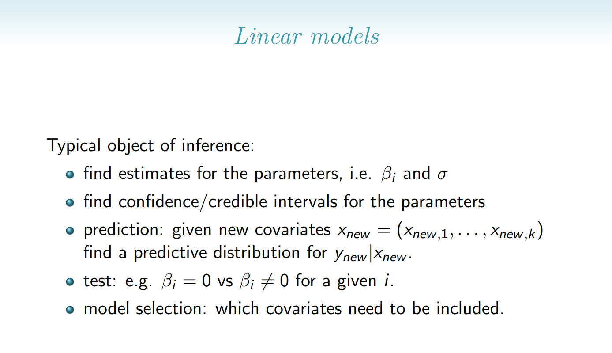

```{r}
library(rjags)
library(BAS)
library("ggplot2")
```

Loading data

```{r}
data <- read.csv("Energy_Efficiency.csv")
```

## Data Overview

Data consists of two responses and eight attributes:

• X1 Relative Compactness
• X2 Surface Area
• X3 Wall Area
• X4 Roof Area
• X5 Overall Height
• X6 Orientation (categorical)
• X7 Glazing Area 
• X8 Glazing Area Distribution (categorical)
• y1 Heating Load
• y2 Cooling Load

Renaming the columns to make them more understandable

```{r}
colnames(data) <- c('Relative_Compactness',
                      'Surface_Area',
                      'Wall_Area',
                      'Roof_Area',
                      'Overall_Height',
                      'Orientation', 
                      'Glazing_Area',
                      'Glazing_Area_Distribution',
                      'Heating_Load',
                      'Cooling_Load')

```


```{r}
head(data)
```


```{r}
summary(data) #basic statistical properties for the data
str(data)     #type of data and counts
```


Looking for Null-values in the data
```{r}
colSums(is.na(data))
```
No null-values found.


## Data Visualization

saving categorical predictors for plotting
```{r}
numerical_attributes <- c(
  'Relative_Compactness', 'Surface_Area', 'Wall_Area', 'Roof_Area',
  'Overall_Height', 'Glazing_Area'
)


```

### Histograms
Plotting histograms for both the response variables
```{r}
old_par <- par(mfrow = c(1, 2), mar = c(4, 4, 3, 2) + 0.1)
# histogram with added parameters
heating_load <-data[['Heating_Load']]

hist(heating_load,
main="Heating Load",
xlab="Heating Load [W]",
ylab="Frequenzy",
xlim=c(0,max(heating_load)+10),
col="darkmagenta"
)

cooling_load <-data[['Cooling_Load']]

hist(cooling_load,
main="Cooling Load",
xlab="Cooling Load [W]",
ylab="Frequenzy",
xlim=c(0,max(cooling_load)+10),
col="coral"
)


```
### Histograms for features
If we later want to mean-center the data, we should preferibly have normally distributed data. Furhter more, strictly possitive skewed data, we should use a log transform on. 
IMPORTANT: USE TRANSFORMATIONS, look for the positive skewness Lecture 11, 41:38, perhaps go back a bit

```{r}
plot_feature_histograms <- function(data, exclude_cols = c("Heating_Load", "Cooling_Load")) {
  numeric_features <- names(data)[sapply(data, is.numeric)]
  features_to_plot <- setdiff(numeric_features, exclude_cols)
  n_features <- length(features_to_plot)
  
  # Set layout
  old_par <- par(mfrow = c(ceiling(n_features / 2), 2), mar = c(4, 4, 3, 2) + 0.1)

  for (feature in features_to_plot) {
    x <- data[[feature]]
    # Check if strictly positive for possible log-transform
    is_positive <- all(x > 0)
    # Quick skew check
    skewness_val <- if (is_positive) {
      mean((x - mean(x))^3) / sd(x)^3
    } else {
      NA
    }

    hist(x,
         main = paste0(feature, 
                       if (!is.na(skewness_val) && skewness_val > 1) " (Consider log)" else ""),
         xlab = feature,
         ylab = "Frequency",
         col = "skyblue",
         border = "white")
  }

  par(old_par)
}

plot_feature_histograms(data)

```
As seen in the data, it is not neccesary to per


### Boxplots
plotting boxplots for data
```{r}
boxplot(data,col="lightblue", las = 2)
```
We notice that there is a scaling problem with the data. This can cause the regression to prioritize certain features. 
Solution: mean-centre the data.

Looking at individual boxplots, categorical values not included
```{r}

# Creating a plotting layout for a grid (2 rows, 4 columns)
old_par <- par(mfrow = c(2, 3), mar = c(4, 4, 3, 2) + 0.1)

# Looping through each numerical column to create a boxplot
for (col_name in numerical_attributes) {
  boxplot(data[[col_name]],
          main = paste(gsub("_", " ", col_name)), # Title for each plot
          ylab = "Value", # Y-axis label
          col = "lightblue", # Color of the boxplot
          las = 1 # Always horizontal axis labels for values
  )
}

par(old_par)
```
Also Roof Area, Relative Compactness and Glazing Area has a slight degree of skewness.  
Solution: use a prior distribution with a marked tail.

### Scatterplots

Categorical attributes not included

Scatterplots for Heat Load
```{r}
old_par <- par(mfrow = c(2, 3), mar = c(0, 0, 0, 0) + 3.8)


for (predictor_col in numerical_attributes) {
    plot(data[[predictor_col]], data[["Heating_Load"]],
         xlab = gsub("_", " ", predictor_col),  
         ylab = "Heating Load", 
         main = paste("Heating Load", "vs.", gsub("_", " ", predictor_col)), # Dynamic title
         col = "steelblue", # Point color
         pch = 16,          # Solid circles for points
         cex = 0.8,          # Size of points
         ylim = c(0, max(data[["Heating_Load"]]))
    )
}

```
We notice highly unlinear behaviour for Relative Compactness, and Surface Area


```{r}

old_par <- par(mfrow = c(2, 3), mar = c(0, 0, 0, 0) + 3.8)

for (predictor_col in numerical_attributes) {
    plot(data[[predictor_col]], data[["Cooling_Load"]],
         xlab = gsub("_", " ", predictor_col),  
         ylab = "Cooling Load", 
         main = paste("Cooling Load", "vs.", gsub("_", " ", predictor_col)), # Dynamic title
         col = "steelblue", # Point color
         pch = 16,          # Solid circles for points
         cex = 0.8,          # Size of points
         ylim = c(0, max(data[["Cooling_Load"]]))
    )
}


```


## Categorical Value Visualization

Analyzing orientation
```{r}
orientation_counts <- table(data[["Orientation"]]) #convert dataframe to vector  
print(orientation_counts)


barplot(orientation_counts,
        col = "orange",
        main = "Distribution of Orientations (X6)",
        xlab = "Orientation Category",
        ylab = "Frequency",
        xlim = c(0, 1),
        ylim = c(0, max(orientation_counts)+100),
        width = 0.1
        ) 
```

Analyzing Glazing Area Distribution
```{r}

glazing_area_counts <- table(data[["Glazing_Area_Distribution"]]) #convert dataframe to vector  
print(glazing_area_counts)

barplot(glazing_area_counts,
        col = "red",
        main = "Distribution of Glazing Area Distribution (X8)",
        xlab = "Orientation Category",
        ylab = "Frequency",
        xlim = c(0, 1),
        ylim = c(0, max(glazing_area_counts)+100),
        width = 0.1
        ) 
```

## Preprocessing


### Convert categorical attributes

To convert categorical attributes, replace categorical attributes with m-1 indicator attributes, where m = number of categories. One variable must be removed in order for X to be invertable
This can be automatically done with the as.factor function, https://www.rdocumentation.org/packages/h2o/versions/2.4.3.11/topics/as.factor

```{r}
transform_categorical_attributes <- function(data){

  categorical_attributes <- c('Orientation', 'Glazing_Area_Distribution')

  for(attribute in categorical_attributes){
    # Convert the column to a factor
    data[[attribute]] <- as.factor(data[[attribute]])
  }

  return(data) 
}

data <- transform_categorical_attributes(data)
```


### Mean Center
We only wish to mean center non-categorical attributes, mean centering will make the final model parameters more interpretative. 

NOTE: This is only good to do if the features are normally distributed
NOTE: If the test data is very different from our training-data, our mean-center scales might be wrong.  
```{r}

mean_center <- function(data) {
  unscaled_cols <- list('Orientation','Glazing_Area_Distribution','Heating_Load','Cooling_Load') #list of columns to not mean center (categorical + response vars)
  for(attribute in colnames(data)){
    if(attribute %in% unscaled_cols){next}
    data[attribute] <-  as.vector(scale(data[attribute])) #mean center the data
    }
  return(data)
}

data <- mean_center(data)
```


### Split into training/test set
```{r}
set.seed(42)

#use 80% of dataset as training set and 20% as test set
sample <- sample(c(TRUE, FALSE), nrow(data), replace=TRUE, prob=c(0.7,0.3))
train  <- data[sample, ]
test   <- data[!sample, ]

formula_full <- Heating_Load ~ Relative_Compactness + Surface_Area + Wall_Area + Roof_Area + Overall_Height + Orientation + Glazing_Area + Glazing_Area_Distribution

# Training set
X <- model.matrix(formula_full, data = train)
y <- as.matrix(train["Heating_Load"])

#Test set
X_test <- model.matrix(formula_full, data = test)
y_test <- as.matrix(test["Heating_Load"])

```

## Model Selection


The goal of this sections is to perform linear regression in the Bayesian framework. The linear model is given by:
 
$$
y = X\beta+\epsilon  
$$
where
$$
\epsilon \sim \mathcal{N}(0, \sigma^2)
$$


The likelihood of $y$ given $\beta$, $\sigma^2$, and $X$ is normally distributed:

$$
y|\beta, \sigma^2, X \sim \mathcal{N}(X\beta, \sigma^2 I_n) \quad \text{likelihood}
$$

The prior distribution for the parameters $(\beta, \sigma^2)$ is given by $\pi(\beta, \sigma^2)$:

$$
(\beta, \sigma^2) \sim \pi(\beta, \sigma^2) \quad \text{prior}
$$
The objective of the analysis is to find good prior distributions.

### Conjugate prior
Conjugate priors have posteriors that can be easily calculated without simulation. However, there are many hyperparameters to tune. The prior distribution is the following:
$$
\beta|\sigma^2 \sim \mathcal{N}_{k+1}(\tilde{\beta}, \sigma^2 M^{-1}),
$$

$$
\sigma^2 \sim \mathcal{IG}(a, b)   
$$
The hyperparameters to tune are $a$, $b$ and $M$ where $M$ is a $(k-1)(k-1)$ matrix and $k$ is the number of attributes in the dataset.   

#### Arbitrary values for hyper parameters

Testing a model with no information on the prior. Using $$M = I_{k+1}/c$$ to reduce the number of hyperparameters. Using large values on diagonal (imply high variance) to force the learning to come from the data 

Finding the posteriror analytically:
```{r}

# Get the dimension, note that X already have intercept-columns
k<-ncol(X) 
n<-nrow(X)

#defining hyperparameters:
a<-1    #low to get a flat distribution to account for uncertainty in prior 
b<-1    #low to get a flat distribution to account for uncertainty in prior
beta_pri <- rep(0, k) #zero to account for uncertainty in prior
c<-1000 #large to account for uncertainty in prior
M <- diag(k) * c

#calculating posterior
XtX <- t(X) %*% X
beta_hat <- solve(XtX) %*% t(X) %*% y
s2 <- t(y-X %*% beta_hat) %*% (y-X%*%beta_hat)

beta_post_cm <- solve(M + XtX) %*% (XtX %*% beta_hat+M %*% beta_pri)
M_post    <- solve(M+XtX)
a_post    <- n/2 + a
b_post    <- b + s2/2 + 1/2* (t(beta_post_cm-beta_hat) %*% solve(solve(M) + solve(XtX)) %*% (beta_post_cm-beta_hat))

```

Analyzing the beta coefficients to see what coefficients are relevant for the response
```{r}

print_beta <- function(beta_vector, names = NULL) {
  beta_values <- as.vector(beta_vector)  # Ensure it's a numeric vector
  
  # Use provided names or default to "Beta_1", "Beta_2", ...
  if (is.null(names)) {
    names <- paste0("Beta_", seq_along(beta_values))
  }

  for (i in seq_along(beta_values)) {
    cat(names[i], ": ", round(beta_values[i], 4), "\n")
  }
}

print_beta(beta_post_cm)
```
Sicne the data is mean centeres, it is evident that Beta_1 or Relative Compactness. 


### Testing Conjugate Model


### Conjugate prior


```{r}
predictions_conjugate_model <- X_test %*% beta_post_cm

```


### Results
using Mean Square Error to see results
```{r}
mse <- mean((y_test - predictions_conjugate_model)^2)
cat("Test MSE:", mse, "\n")

```


### g-prior (Zellners), fitting a hierarchy of nested models 

```{r}
alphapar = 30 #More info on selecting alpha will be presented later

cog.bas = bas.lm(
  formula = Heating_Load ~ Relative_Compactness + Surface_Area + Wall_Area + Roof_Area + Overall_Height + Orientation + Glazing_Area + Glazing_Area_Distribution,
  data = train,
  prior = "g-prior",
  alpha = alphapar, #hyperparameter for g-prior
  modelprior = Bernoulli(1), #Modelprior is bernoulli(1) 
  include.always = ~ .,      #Include all the predictors
  n.models = 1               #number of models
)

beta = coef(cog.bas)
print(beta)

```
```{r}
confint(beta)

```


#Notes to Self, IMPORTANT!!!:
If you know that a feature is allays positive, ex. price, use the logarithm of price instead. 


## Model Testing
All models are trained on the same training-set, and a 80/20 split is used for training and test set validation. 


